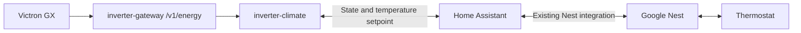

# inverter-climate

Energy-aware climate coordination through **Home Assistant** and
**inverter-gateway**. Google Nest remains connected through Home Assistant's
existing integration; this service needs no Google credentials or additional
Google project.

The first use case is a gas furnace that consumes approximately **500 W of
electricity while heating**. Gas supplies the heat; electricity runs the furnace
and associated equipment. This service can shift useful heating toward measured
solar export. It does **not** measure gas usage, guarantee financial savings, or
create a reason to burn additional gas just to consume electricity.

**Version 0.1 starts in observation mode.** It records what it would do without
changing the thermostat. Only explicit `mode = "active"` enables setpoint writes.

## Connections



Run the service on an always-on Linux server/container. It does not require the
desktop app to be open and does not run its cloud requests on the inverter.

## First run

Requires Python 3.12+ and [uv](https://docs.astral.sh/uv/).

```sh
uv sync --frozen
cp examples/config.toml config.toml
cp .env.example .env
# Fill .env locally; never commit it. Use your actual climate entity in config.toml.
uv run --env-file .env inverter-climate --discover
uv run --env-file .env inverter-climate --config config.toml --once
uv run --env-file .env inverter-climate --config config.toml
```

`--discover` only reads Home Assistant. `--once` exits 1 on an integration error,
2 on configuration/state failure, and 0 on a completed observation. The persistent
service continues polling on transient upstream errors, recording the reason.
Both integrations are needed before a boost is eligible; unavailable energy is
never converted to zero or inferred from other readings.

Private environment variables:

- `HA_BASE_URL`, `HA_TOKEN`: configured HA origin and long-lived access token.
- `GATEWAY_BASE_URL`, `GATEWAY_READ_TOKEN`: gateway origin and **read-only** token.
- `CF_ACCESS_CLIENT_ID`, `CF_ACCESS_CLIENT_SECRET`: optional Access service credentials.

Base URLs must be origins, optionally ending in `/`; proxy path prefixes are not
supported in this version. HTTPS certificate validation stays enabled, redirects
are rejected and environment proxies are ignored. HTTP is supported for a trusted
local network. Tokens are sent only to the explicitly configured origin.

## Policy

All policy temperatures use **°C**. Actual HA temperatures/commands are converted
using `/api/config`'s temperature unit. The default comfort band of 17–19 °C is an
example to review for your household, not a universal heating recommendation.

1. Respect the existing thermostat target as the baseline. Only `heat` mode,
   `idle`/`heating` action, no preset, and target-temperature capability qualify.
   `off`, cooling, heat/cool ranges, eco presets, and unavailable devices receive
   no new boost. The service never changes HVAC mode or switches furnace power.
2. Require fresh schema-v1 gateway readings for solar, grid power, battery power
   and state of charge. Positive grid power means import; negative means export.
   Positive battery power means charging. Configure complete sources in the
   [gateway energy contract](https://github.com/victron-venus/inverter-gateway/blob/main/docs/energy-api.md).
3. Require at least 600 W of export for 180 seconds by default: 500 W estimated
   furnace draw plus 100 W margin, solar output at least 500 W, battery SoC at
   least 90%, and no battery discharge above the 50 W tolerance.
4. Raise the existing target by up to 0.5 °C, bounded by the comfort ceiling and
   device limits/step. Do nothing if the room is already warm enough. A missing
   device step uses 0.5 °C or 1 °F; for Fahrenheit devices configure a boost delta
   of at least 5/9 °C (for example 0.6) to permit one native degree.
5. Normally retain a boost for at least 15 minutes and at most 30. While already
   heating, its estimated 500 W is added back only when checking whether an
   existing boost can continue. This is an estimate, not a dedicated wattmeter.
6. Restore the original target on expiry, loss of valid energy data, excessive
   grid import/battery discharge, low SoC, or the comfort ceiling. These release
   conditions can override the minimum boost duration. Restoring a setpoint is
   not direct burner switching; the thermostat retains its own cycle protection.
7. Any observed external target/mode/preset change relinquishes ownership and
   suspends boosts for two hours. Completed restoration also starts a cooldown.

This first policy uses **measured net export only**. It does not count battery
charging as spare power, estimate curtailed PV, infer whole-house consumption,
or optimize tariffs/gas prices. A zero-export ESS may therefore never qualify
even when additional solar generation could be available. These are deliberate
limits for initial observation, to be improved with measured evidence.

## Commands and recovery

Before a service call, re-read the thermostat and persist the exact command
intent atomically. A later observed setpoint confirms the command. A timeout or
ambiguous result is **not retried**; the journal retains the intent so late
confirmation can still be recognized. A command that never confirms is shown
as `boost_unconfirmed_no_retry` or `restore_unconfirmed_no_retry` and needs local
inspection before resetting the journal. Do not delete a journal blindly.

Manual changes made through Nest, HA, a schedule or another controller are all
treated alike. HA/Nest has no compare-and-set operation; a change made between
the final read and service call can race with it. A manual write of the same
numeric target is also indistinguishable from our own confirmation. This is not
a hardware safety controller or a replacement for the thermostat's protections.

The journal binds to the HA origin and entity and survives restarts. Corruption
or an identity mismatch stops the service. A filesystem lock prevents two local
instances sharing that journal. Operate exactly **one active instance per
thermostat**; separate hosts/journals do not provide a distributed lock.

To stop active coordination cleanly, first stop the existing daemon/container
without deleting its journal or volume. A second process cannot acquire its lock.
Retain `mode = "active"` and run exactly one foreground release instance with
the same configuration, credentials and persistent state:

```sh
uv run --env-file .env inverter-climate --config config.toml --release
```

This releases only a still-owned boost and never begins another one. It exits
once the journal is idle; after confirmed restoration, switch to observation
mode before restarting your usual service.
Switching directly to observe, terminating the process, losing HA/Google access,
or powering off the host cannot guarantee immediate restoration. The thermostat
continues its own current setpoint; restarting active mode reconciles the journal.

The status JSON contains observations, the last decision, and integration health.
Logs omit endpoint/entity identity and credentials. Keep state/status on private
persistent storage; do not publish household observations.

## Container and systemd

See [deployment](deploy/README.md) for Docker Compose and systemd examples.
The container runs as a non-root user; mount writable persistent `/data` and a
read-only configuration file. No public HTTP listener is opened.

## Development

```sh
uv sync --frozen
uv run ruff check .
uv run ruff format --check .
uv run pytest
uv build
```

Tests cover transport boundaries, malformed/stale data, temperature units,
control transitions, manual changes, restart journals, and uncertain command
outcomes. CI runs on Python 3.12 and 3.13. Public source contains example
identifiers only; tokens and household configuration belong outside Git.

Repository infrastructure is owned by the isolated
`terraform-github-4alvit/stacks/inverter-climate-repository` Terraform stack.

## Upstream references

- [Home Assistant REST API](https://developers.home-assistant.io/docs/api/rest/)
- [Home Assistant climate](https://www.home-assistant.io/integrations/climate/)
- [Google Nest integration](https://www.home-assistant.io/integrations/nest/)
- [Victron GX Opportunity Loads](https://www.victronenergy.com/media/pg/Cerbo_GX/en/gx-opportunity-loads.html)

This is an independent integration, not a native Victron Nest driver.
